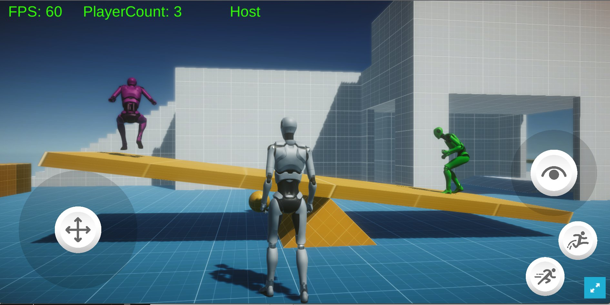

# PhotonFusionSeminar03

Photon Fusion Seminar 03 Sample Project

本リポジトリをクローンしたら、Unity Hub 経由でクローンしたフォルダからプロジェクトを開きます  
続いて次の
[Starter Assets - Third Person Character Controller](https://assetstore.unity.com/packages/essentials/starter-assets-third-person-character-controller-196526)
アセットを購入し（無料）  
 Package Manager 経由でアセットをインポートしますが  
 Assets/SimplestarGame/Playground.unity シーンを上書きしてしまうので、インポート対象から外しておきます  
 もし上書きしてしまった場合は、更新を破棄して作業を続行してください

その後 [Photon Fusion SDK](https://doc.photonengine.com/fusion/current/getting-started/sdk-download) のページから .unitypackage をダウンロードし、プロジェクトにインポートします

Photon Fusion のアプリを [Dashboard](https://dashboard.photonengine.com/) ページから作成し、App ID を PhotonAppSettings ファイルに書き込みます

以上の準備が整ったら Assets/SimplestarGame/Playground.unity シーンを開きます  
ここでもし、Starter Assets - Third Person Character Controller のインポートで誤ってシーンを上書きしてしまっていたら、更新を破棄してクローンした状態に戻してください  
更新なしの Assets/SimplestarGame/Playground.unity シーンを再生すると、セッションに参加し Host となり、ビルド成果物などを実行すると Client としてセッションに参加することでしょう  
プレイヤーエージェントのキャラクターモデルがそれぞれのシーンで位置・回転、アニメーションの同期がとれている様子が確認できると思います

三回目の説明となり、しつこいようですが FPS や PlayerCount、Host or Client の UI 表示がない場合は  
Starter Assets - Third Person Character Controller のインポートで誤ってシーンを上書きしてしまっている可能性があります  
変更を破棄してからシーンをリロードして、お試しください
